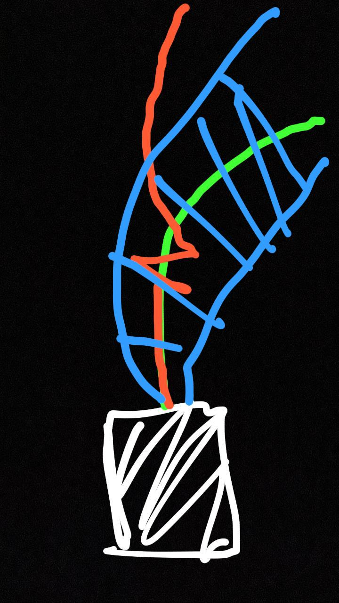

# Vehicle Model Constrained Visual Odometry for Enhanced Trajectory Estimation

We aim to address the challenge of accurately estimating vehicle trajectories from dashcam footage. The conventional method of visual odometry (VO), while popular, is susceptible to noise due to sudden camera movements, leading to significant errors in trajectory estimation. To overcome this limitation, we introduce a novel approach: Vehicle Model Constrained Visual Odometry.

Our method integrates the constraints of a vehicle's physical capabilities, specifically steering angle rate (S') and acceleration (A), into the VO process. By considering the bounds on these parameters, we significantly reduce the search space for possible trajectories. For a given steering angle (S) and velocity (V), and at a time step t milliseconds away, the vehicle's state is constrained within specific ranges: Velocity (V_t) falls within [V +/- A.t], and Steering angle (S_t) within [S +/- S'.t]. This incorporation of physical constraints is executed through the bicycle model (Bic), which inputs the vehicle's state and time step to output the next trajectory point.

Our approach effectively filters out infeasible trajectories that the vehicle cannot execute, thereby refining the accuracy of the trajectory estimation. This paper demonstrates that by embedding vehicle dynamics into visual odometry, the accuracy of trajectory estimation from dashcam videos can be substantially improved, offering a robust solution for applications in autonomous navigation and traffic monitoring.


Following is a visual representation of visual odomentry. The red path is the raw VO trajectory, while the green path is the ground truth trajectory (GPS). The blue band shows the range of possible trajectories.




# Literature Survey

TODO

# Dataset

Download the Bengaluru Driving Dataset from [huggingface.co/datasets/AdityaNG/BengaluruDrivingDatasetRaw](https://huggingface.co/datasets/AdityaNG/BengaluruDrivingDatasetRaw) to `~/Datasets/dataset`.

```bash
GIT_LFS_SKIP_SMUDGE=1 git clone https://huggingface.co/datasets/AdityaNG/BengaluruDrivingDatasetRaw -d ~/Datasets/
```

# Getting Started

Create a venv and setup precommit hooks.
```bash
python3 -m venv venv  # Python 3.8.10
source venv/bin/activate
pip install -r requirements.txt

pre-commit install
```

Before running `git commit`, run precommit hooks on all files.
```bash
pre-commit run --all-files
```

Visualize the trajectory
```bash
python3 -m vmvo.scripts.visualize_trajectory --dataset 1652937970859
```
