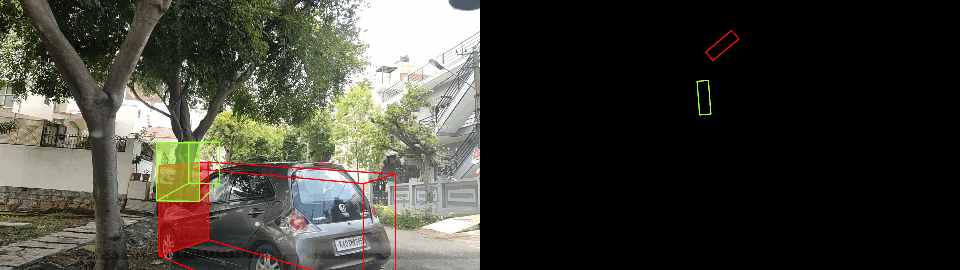
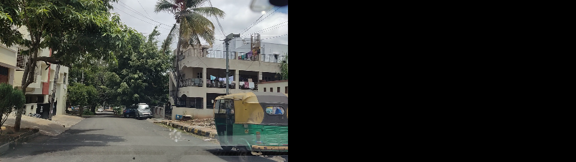
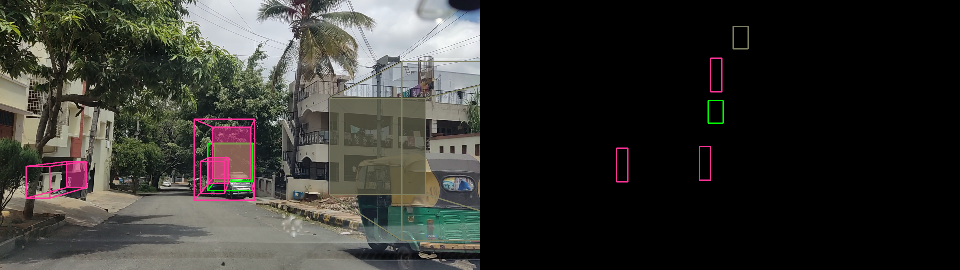
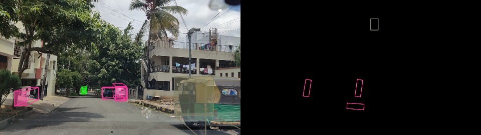

# Auto-Labelling Vehicle Trajectory and 3D Bounding Boxes using Foundation Models with Camera Intrinsics and Vehicle Model Constraints


- [ Drive](https://drive.google.com/drive/folders/1zXarXIDn4bL3HWTgiCcW4KRLFyTCR_b8)
- [ TODO List](https://docs.google.com/document/d/1ddBDz1K5p8a4-3uJu34OwmqwoTkxCpuPl9MD4Fd-oOw/edit)
- [ Paper Notes](https://docs.google.com/document/d/12j_IuQAWbkB1hlW-l-nWGg0moCimFiMsJ226KElKJq0/edit#heading=h.yqeo319th3x1)


 - Auto labelling Trajectory
    - [DONE] Applying Visual Odometry to get an initial estimate
    - Using the vehicle model constraints to fine tune this estimate
    - Integrating GPS and IMU data
 - Auto labelling 3D Bounding Boxes
    - [DONE] Using Camera Constraints and YOLOv5 to produce a set of target 3D Bounding Boxes
    - using OpenAI's GPT Vision: feed in the visualized 3D bbox along with object class, bounding box size/orientation/position. Prompt the model to make fine adjustments to the 3D bbox. Iteratively refine the 3D bbox until GPT Vision says it is done (or max iterations is reached).
    - Apply the vehicle trajectory to interpolate the bounding boxes
 - Baseline Models:
    - Train DriveGPT to predict the trajectory
    - Train DEVIANT to predict the 3D Bounding Boxes

# Vehicle Model Constrained Visual Odometry for Enhanced Trajectory Estimation

We aim to address the challenge of accurately estimating vehicle trajectories from dashcam footage. The conventional method of visual odometry (VO), while popular, is susceptible to noise due to sudden camera movements, leading to significant errors in trajectory estimation. To overcome this limitation, we introduce a novel approach: Vehicle Model Constrained Visual Odometry.

Our method integrates the constraints of a vehicle's physical capabilities, specifically steering angle rate (S') and acceleration (A), into the VO process. By considering the bounds on these parameters, we significantly reduce the search space for possible trajectories. For a given steering angle (S) and velocity (V), and at a time step t milliseconds away, the vehicle's state is constrained within specific ranges: Velocity (V_t) falls within [V +/- A.t], and Steering angle (S_t) within [S +/- S'.t]. This incorporation of physical constraints is executed through the bicycle model (Bic), which inputs the vehicle's state and time step to output the next trajectory point.

Our approach effectively filters out infeasible trajectories that the vehicle cannot execute, thereby refining the accuracy of the trajectory estimation. This paper demonstrates that by embedding vehicle dynamics into visual odometry, the accuracy of trajectory estimation from dashcam videos can be substantially improved, offering a robust solution for applications in autonomous navigation and traffic monitoring.


Following is a visual representation of visual odometry. The red path is the raw VO trajectory, while the green path is the ground truth trajectory (GPS). The blue band shows the range of possible trajectories.


With the trajectories computed, we fine tune DriveGPT.

# Monocular 3D Object Detection



We want to autolabel the 3D bounding boxes for the dataset using OpenAI's GPT Vision.
We aim to use the vehicle trajectory, interpolation to augment the 3D bounding box labels.

First, we use YOLOv5 to detect the 2D bounding boxes. Then, we use OpenAI's GPT Vision to iteratively refine the 3D bounding boxes. This iterative process involves feeding in the visualization of the labels projected on the camera plane and the BEV plane, along with the object class, bounding box size/orientation/position. We prompt the model to make fine adjustments to the 3D bbox. We iteratively refine the 3D bbox until GPT Vision says it is done (or max iterations is reached).


- Input Image
    - 
- YOLO Guess
    - 
- GPT Auto Labels
    - 

Finally, using our auto-labelled dataset, we fine tune the DEVIANT model.

# Dataset

Download the Bengaluru Driving Dataset from [huggingface.co/datasets/AdityaNG/BengaluruDrivingDatasetRaw](https://huggingface.co/datasets/AdityaNG/BengaluruDrivingDatasetRaw) to `~/Datasets/dataset`.

```bash
GIT_LFS_SKIP_SMUDGE=1 git clone https://huggingface.co/datasets/AdityaNG/BengaluruDrivingDatasetRaw -d ~/Datasets/
cd ~/Datasets
git lfs pull
```

# Getting Started

Create a venv and setup precommit hooks.
```bash
python3 -m venv venv  # Python 3.9.5
source venv/bin/activate
python3 -m pip install torch torchvision torchaudio --index-url https://download.pytorch.org/whl/cu118
python3 -m pip install -r requirements.txt

pre-commit install
```

Before running `git commit`, run linting and precommit hooks on all files and.
```bash
python3 -m isort vmvo/ deviant/
python3 -m black -l 79 vmvo/ deviant/
pre-commit run --all-files
```


Visualize the trajectory video
```bash
python3 -m vmvo.scripts.visualize_trajectory_video --dataset 1658384707877
```

Visualize the overall trajectory map
```bash
python3 -m vmvo.scripts.visualize_trajectory --dataset 1658384707877
```

Run the labelling tool
```bash
python3 -m vmvo.scripts.bbox_labeller --dataset 1658384707877
```

Run v1 optimizer (Average of GPS and VO)
```bash
python3 -m vmvo.scripts.optimize_trajectory_v1 --dataset 1658384707877
```

Run v2 optimizer (Vehicle Model over window)
```bash
python3 -m vmvo.scripts.optimize_trajectory_v2 --dataset 1658384707877
```

# Training DEVIANT

Deviant requires a different environment setup. Python 3.7 is required.

```bash
conda create --name DEVIANT --file conda_GUP_environment_a100.txt
conda activate DEVIANT
pip install opencv-python pandas
```

Train DEVIANT
```bash
python3 -m deviant.tools.train_val --config=deviant/experiments/run_000001.yaml
```